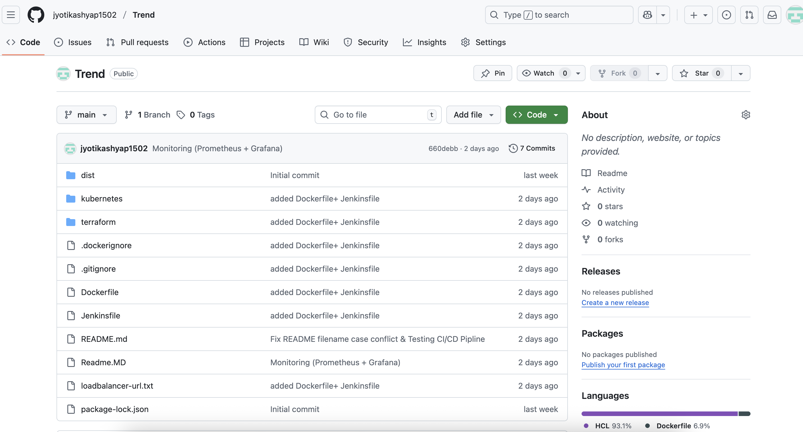
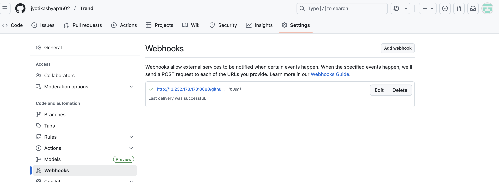
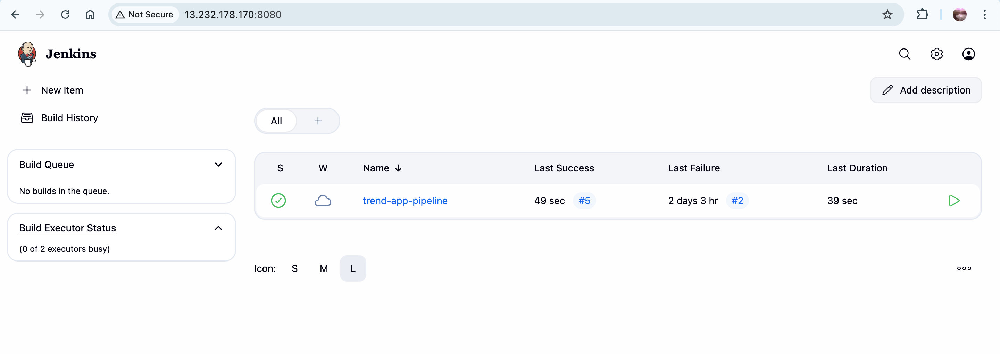
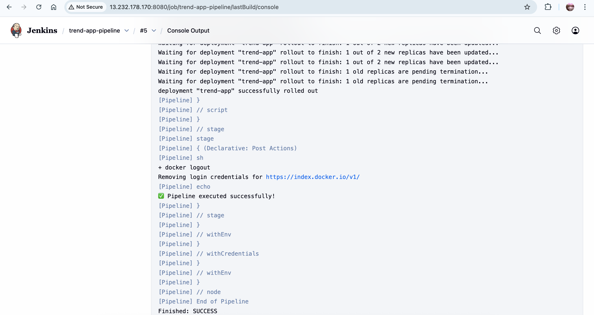
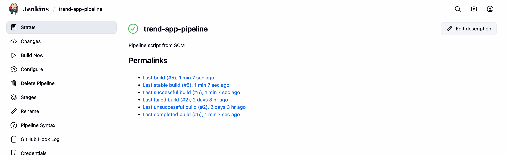
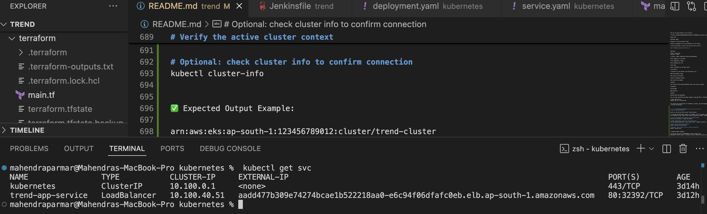
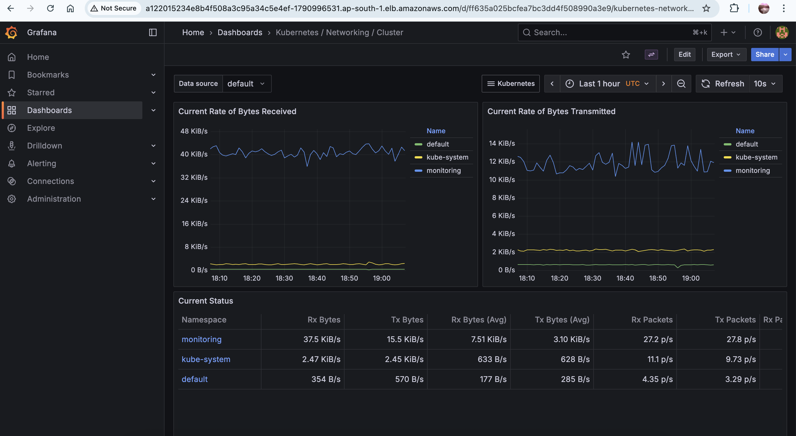

# Trend  Project

## Prerequisites

Before starting, ensure the following tools are installed on your system:

- **AWS CLI:** v2.31+ (`aws --version`)
- **Docker:** v20.10+ (`docker --version`)
- **Terraform:** v1.6+ (`terraform --version`)
- **kubectl:** v1.28+ (`kubectl version --client`)
- **eksctl:** v0.180+ (`eksctl version`)
- **Node.js:** v18+ (`node --version`)
- **npm:** v9+ (`npm --version`)

If any tool is missing, refer to the installation guides in the official documentation or see Step 1.1 of the deployment guide below.


## Running the Project

Follow these steps to run the project locally:

1. Navigate to the project directory:

```bash
cd path/to/trend 
```

2. Install the `serve` package globally:

```bash
sudo npm install -g serve
```

3. Verify the installation:

```bash
serve -v
```

4. Serve the production build:

```bash
serve -s dist
```

The project should now be running locally, and you can access it in your browser.

## after creating Docker File

# Build Docker image
docker build -t trend-app:latest .

# Run the container
docker run -d -p 3000:80 trend-app:latest

# go to the browser and test it.
test the project on localhost

----------------
Step 1.2: Configure AWS Credentials
If this is your first time using AWS CLI, configure your credentials:
# Configure AWS CLI (use your AWS credentials)
aws configure
# AWS Access Key ID: YOUR_ACCESS_KEY
# AWS Secret Access Key: YOUR_SECRET_KEY
# Default region name: ap-south-1  (or your preferred region)
# Default output format: json

If AWS CLI is already configured, verify your setup with:

# Verify current AWS identity and configuration
aws sts get-caller-identity
aws configure list
✅ Example Output:
{
    "UserId": "AIDAEXAMPLEUSERID",
    "Account": "123456789012",
    "Arn": "arn:aws:iam::123456789012:user/your-username"
}
✅ Note:
Make sure the region is set to ap-south-1 for this project to ensure all AWS resources are created in the correct region.

Step 1.3: Clone the Repository
# Clone the project
git clone https://github.com/Vennilavan12/Trend.git
cd Trend

Step 1.4: Create Configuration Files

.env.example 
.gitignore
.dockerignore

Step 1.5: Create Project Structure

mkdir -p terraform
mkdir -p kubernetes
mkdir -p jenkins
mkdir -p .github/workflows

# Phase 2: Docker
Step 2.1:Create Dockerfile
Step 2.2: Build and Test Docker Image Locally

# Build the Docker image
docker build -t trend-app:latest .

# Run the container locally
docker run -d -p 3000:3000 --name trend-app-test trend-app:latest

# Check if container is running
docker ps

# Test the application
curl http://localhost:3000
# Or open in browser: http://localhost:3000

# Check container logs
docker logs trend-app-test

# Stop and remove test container
docker stop trend-app-test
docker rm trend-app-test

# Phase 3: Terraform Infrastructure

Step 3.1: Create Terraform Configuration
terraform/main.tf

# Generate SSH key pair
ssh-keygen -t rsa -b 4096 -f ~/.ssh/id_rsa -N ""

Step 3.3: Deploy Infrastructure
cd terraform

# Initialize Terraform
terraform init

# Validate configuration
terraform validate

# Preview changes
terraform plan

# Apply configuration (this will create resources)
terraform apply

# Type 'yes' when prompted

# Save outputs
terraform output > ../terraform-outputs.txt //⚠️ Important: Note down the Jenkins public IP from the output!

# Phase 4: DockerHub Setup (15 minutes)

Step 4.1: Create DockerHub Repository

Name: trend-app 
Visibility: Public

Step 4.2: Push Image to DockerHub

# Login to DockerHub
docker login
# Enter your DockerHub username and password

# Tag your image
docker tag trend-app:latest YOUR_DOCKERHUB_USERNAME/trend-app:latest

# Push to DockerHub
docker push YOUR_DOCKERHUB_USERNAME/trend-app:latest

# Verify push
docker pull YOUR_DOCKERHUB_USERNAME/trend-app:latest

# Phase 5: Kubernetes (AWS EKS) 
Step 5.1: Create EKS Cluster
# Create EKS cluster 
eksctl create cluster \
  --name trend-cluster \
  --region ap-south-1 \
  --nodegroup-name trend-nodes \
  --node-type t3.medium \
  --nodes 2 \
  --nodes-min 1 \
  --nodes-max 3 \
  --managed

# Verify cluster
kubectl get nodes

# Update kubeconfig
aws eks update-kubeconfig --name trend-cluster --region ap-south-1

Step 5.2: Create Kubernetes Manifests

create 
kubernetes/deployment.yaml
kubernetes/service.yaml

Step 5.3: Deploy to Kubernetes

cd kubernetes

# Apply deployment
kubectl apply -f deployment.yaml

# Apply service
kubectl apply -f service.yaml

# Check deployment status
kubectl get deployments
kubectl get pods
kubectl get services

# Wait for LoadBalancer to be ready (may take 2-3 minutes)
kubectl get svc trend-app-service -w

# Get the LoadBalancer URL
kubectl get svc trend-app-service -o jsonpath='{.status.loadBalancer.ingress[0].hostname}'


## Common Issues & Solutions for above step - we have fixed this 

### 1. Exec Format Error (ARM64 vs AMD64)
If deploying from Apple Silicon Mac (M1/M2/M3), always build Docker images for AMD64:
```bash
docker buildx build --platform linux/amd64 -t your-image:tag --push .
```

### 2. LoadBalancer Pending State
If LoadBalancer stuck in `<pending>`:
- Check `kubectl describe svc <service-name>` for errors
- Verify subnet tags for ELB
- Remove unsupported sessionAffinity configurations
- Ensure AWS service limits not exceeded

### 3. ImagePullBackOff
- Verify DockerHub image name is correct in deployment.yaml
- Ensure image is public or ImagePullSecrets configured
- Check DockerHub repository exists

### 4. CrashLoopBackOff
- Check pod logs: `kubectl logs <pod-name>`
- Verify application runs correctly in Docker locally
- Check resource limits and health checks

#save the url loadbalancer-url.txt
echo $LB_URL > ../loadbalancer-url.txt

# Phase 6: Jenkins CI/CD Pipeline 
Step 6.1: Access Jenkins

# Get Jenkins initial password
ssh -i ~/.ssh/id_rsa ubuntu@JENKINS_PUBLIC_IP

sudo cat /var/lib/jenkins/secrets/initialAdminPassword
# Copy this password

# Exit SSH
exit


Visit: http://JENKINS_PUBLIC_IP:8080

Enter the initial admin password
Click "Install suggested plugins"
Create admin user
Save and Continue

Step 6.2: Install Required Plugins

Go to "Manage Jenkins" → "Manage Plugins"
Click "Available" tab
Search and install:

Docker Pipeline
Kubernetes
Git
GitHub Integration
Pipeline


Click "Install without restart"
Check "Restart Jenkins when installation is complete"

Step 6.3: Configure Credentials
DockerHub Credentials:

"Manage Jenkins" → "Credentials" → "System" → "Global credentials"
"Add Credentials"

Kind: Username with password
Username: YOUR_DOCKERHUB_USERNAME
Password: YOUR_DOCKERHUB_PASSWORD
ID: dockerhub-credentials


GitHub Credentials:

Generate GitHub Personal Access Token:

GitHub → Settings → Developer settings → Personal access tokens → Tokens (classic)
Generate new token with repo and admin:repo_hook scopes


Add to Jenkins:

Kind: Secret text
Secret: YOUR_GITHUB_TOKEN
ID: github-token


AWS Credentials (if not using IAM role):

"Add Credentials"
# commant -if not see Kind: AWS Credentials add plugin of AWS Credentials in jenkins->manage plugin search and add it- then follow bellow

Kind: AWS Credentials
ID: aws-credentials
Access Key ID: YOUR_AWS_ACCESS_KEY
Secret Access Key: YOUR_AWS_SECRET_KEY

# Step 6.4: Configure Kubernetes in Jenkins

# SSH back into Jenkins server
ssh -i ~/.ssh/id_rsa ubuntu@JENKINS_PUBLIC_IP

# Copy kubeconfig
sudo mkdir -p /var/lib/jenkins/.kube
sudo aws eks update-kubeconfig --name trend-cluster --region ap-south-1 --kubeconfig /var/lib/jenkins/.kube/config
sudo chown -R jenkins:jenkins /var/lib/jenkins/.kube

exit


# Step 6.6: Create Jenkins Pipeline Job

Jenkins Dashboard → "New Item"
Name: trend-app-pipeline
Type: "Pipeline"
Click "OK"

Configure:

Build Triggers:

Check "GitHub hook trigger for GITScm polling"


Pipeline:

Definition: "Pipeline script from SCM"
SCM: Git
Repository URL: https://github.com/{userName}/Trend.git
Credentials: Select your GitHub token
Branch: */main
Script Path: Jenkinsfile


Click "Save"

# Step 6.7: Set Up GitHub Webhook

Go to your GitHub repository
Settings → Webhooks → Add webhook
Payload URL: http://JENKINS_PUBLIC_IP:8080/github-webhook/
Content type: application/json
Disable SSL verification 
Events: "Just the push event"
Click "Add webhook"

# Step 6.8: Test the Pipeline

cd /path/to/Trend
git add Jenkinsfile
git commit -m "Add Jenkins pipeline"
git push origin main


# Common Issues & Fixes in Jenkins EKS Deployment
```
During the integration of Jenkins with EKS for automated deployment, several issues occurred which were resolved step-by-step as follows:

1️⃣ AccessDeniedException – EKS Permissions
Error:
An error occurred (AccessDeniedException) when calling the DescribeCluster operation:
User: arn:aws:iam::<ACCOUNT_ID>:user/jenkins-deploy-trend is not authorized to perform: eks:DescribeCluster

Cause:
The IAM user (jenkins-deploy-trend) didn’t have required permissions to access the EKS cluster.
Solution:
Attach the following AWS managed policies to the Jenkins IAM user:
aws iam attach-user-policy --user-name jenkins-deploy-trend \
  --policy-arn arn:aws:iam::aws:policy/AmazonEKSClusterPolicy

aws iam attach-user-policy --user-name jenkins-deploy-trend \
  --policy-arn arn:aws:iam::aws:policy/AmazonEKSServicePolicy

aws iam attach-user-policy --user-name jenkins-deploy-trend \
  --policy-arn arn:aws:iam::aws:policy/AmazonEC2FullAccess

aws iam attach-user-policy --user-name jenkins-deploy-trend \
  --policy-arn arn:aws:iam::aws:policy/AmazonVPCFullAccess

Then verify:
aws iam list-attached-user-policies --user-name jenkins-deploy-trend

✅ This ensures the Jenkins IAM user can describe, update, and connect to the EKS cluster.

2️⃣ Jenkins Access to EKS Failed – Credentials Error
Error:
error: You must be logged in to the server (the server has asked for the client to provide credentials)

Cause:
The Jenkins IAM user was not authorized inside the cluster’s aws-auth ConfigMap.
Solution:
Grant access to the Jenkins IAM user in your EKS cluster.
From your local machine (where kubectl is configured and working):
kubectl patch configmap aws-auth -n kube-system --type merge -p '{
  "data": {
    "mapUsers": "- userarn: arn:aws:iam::<ACCOUNT_ID>:user/jenkins-deploy-trend\n  username: jenkins\n  groups:\n    - system:masters\n"
  }
}'

Then verify:
kubectl get configmap aws-auth -n kube-system -o yaml

You should now see your IAM user listed under both mapUsers (and optionally mapRoles).

3️⃣ kubeconfig Permission Issue on Jenkins Server
Error:
Can't open kubeconfig for reading: [Errno 13] Permission denied: '/var/lib/jenkins/.kube/config'

Cause:
The Jenkins user didn’t have ownership of the kubeconfig directory.
Solution:
Run the following commands:
sudo mkdir -p /var/lib/jenkins/.kube
sudo aws eks update-kubeconfig \
  --region ap-south-1 \
  --name trend-cluster \
  --kubeconfig /var/lib/jenkins/.kube/config

sudo chown -R jenkins:jenkins /var/lib/jenkins/.kube

Switch to Jenkins user and test:
sudo su - jenkins
kubectl get nodes

✅ You should now see all EKS nodes in Ready state.

4️⃣ Pipeline Failure – “invalid apiVersion client.authentication.k8s.io/v1alpha1”
Error (Jenkins logs):
error: exec plugin: invalid apiVersion "client.authentication.k8s.io/v1alpha1"

Cause:
The kubeconfig file was using an outdated authentication API version.
Solution:
After updating the kubeconfig (as shown above), the aws CLI automatically uses the latest v1beta1 API — fixing this issue.

5️⃣ Final Verification
Switch to Jenkins user and test EKS access:
sudo su - jenkins
kubectl get nodes

✅ Output:
NAME                                            STATUS   ROLES    AGE   VERSION
ip-192-168-35-138.ap-south-1.compute.internal   Ready    <none>   37h   v1.32.9-eks-113cf36
ip-192-168-85-124.ap-south-1.compute.internal   Ready    <none>   37h   v1.32.9-eks-113cf36

Trigger a new build in Jenkins:


Push code changes to GitHub


Jenkins webhook triggers automatically


Build proceeds → Docker image builds → pushed to DockerHub → deployed to EKS successfully 🎯


✅ Final Result


Jenkins user successfully authenticated with EKS cluster


Full CI/CD pipeline works end-to-end:


Code pushed to GitHub


Jenkins builds Docker image


Pushes image to DockerHub


Updates deployment on EKS


Verifies pods and services automatically
```
----------------------------------------


# 🧩 Phase 7: Monitoring (Prometheus + Grafana)

This phase sets up real-time monitoring for the Kubernetes cluster using Prometheus and Grafana with Helm.

🚀 Step 1: Verify Helm Installation

Check if Helm is installed and working:

helm version


If you see output similar to:

version.BuildInfo{Version:"v3.19.0", GitCommit:"3d8990f0836691f0229297773f3524598f46bda6", ...}


Helm is installed successfully.

🏗️ Step 2: Add the Prometheus Helm Repository

Add and update the Prometheus Community Helm repository:

helm repo add prometheus-community https://prometheus-community.github.io/helm-charts
helm repo update


Expected output:

"prometheus-community" has been added to your repositories
Update Complete. ⎈Happy Helming!⎈

🧱 Step 3: Create a Namespace for Monitoring

To keep resources organized, create a dedicated namespace:

kubectl create namespace monitoring


Expected:

namespace/monitoring created

⚙️ Step 4: Install Prometheus Stack (Includes Grafana)

Install the kube-prometheus-stack Helm chart in the monitoring namespace:

helm install prometheus prometheus-community/kube-prometheus-stack -n monitoring


Expected output (partial):

NAME: prometheus
NAMESPACE: monitoring
STATUS: deployed
...


You can verify the deployment using:

kubectl get pods -n monitoring

🔐 Step 5: Get Grafana Admin Password

Once deployed, retrieve the Grafana admin credentials:

kubectl get secret -n monitoring prometheus-grafana -o jsonpath="{.data.admin-password}" | base64 --decode ; echo


Use admin as the username and the decoded password to log in.

🌍 Step 6: Expose Grafana via LoadBalancer

By default, Grafana runs internally. To access it from outside the cluster:

kubectl -n monitoring patch svc prometheus-grafana -p '{"spec": {"type": "LoadBalancer"}}'


Check the assigned external LoadBalancer URL:

kubectl get svc -n monitoring prometheus-grafana -w


Example output:

NAME                 TYPE           CLUSTER-IP       EXTERNAL-IP                                                                PORT(S)        AGE
prometheus-grafana   LoadBalancer   10.100.218.109   a122015234e8b4f508a3c95a34c5e4ef-1790996531.ap-south-1.elb.amazonaws.com   80:30828/TCP   57s

🧭 Step 7: Access Grafana Dashboard

Now you can open Grafana in your browser:

🌐 http://a122015234e8b4f508a3c95a34c5e4ef-1790996531.ap-south-1.elb.amazonaws.com

Login with:

Username: admin

Password: (from the previous step)

You’ll be prompted to set a new password on first login.

To confirm Grafana is active, you can also test via curl:

curl -I http://<grafana-external-ip>


Expected:

HTTP/1.1 302 Found
Location: /login

📊 Step 8: Import Kubernetes Monitoring Dashboard

After logging in to Grafana:

Go to Dashboards → Import

Enter dashboard ID: 315

Click Load

Select Prometheus as the data source

Click Import

✅ Grafana will now display real-time metrics for:

Node CPU & Memory usage

Pod resource utilization

Cluster & namespace health

Pod restarts and uptime

🧠 Notes

This setup uses the kube-prometheus-stack chart which includes:

Prometheus

Alertmanager

Node Exporter

Grafana

Related CRDs and dashboards

You can later add HTTPS and domain support using AWS ACM or Cloudflare.

✅ Final Verification
kubectl get all -n monitoring


You should see running pods for Prometheus, Grafana, and Alertmanager — confirming your monitoring stack is active and healthy.


-----------*******************----------------------------
# how to test the project -

Switch to the Correct EKS Cluster (Trend Project)

If you have multiple EKS clusters (for example, one for another project like brain-tasks), make sure you are connected to the Trend cluster before running any kubectl commands.

# List all available EKS clusters in your AWS account
aws eks list-clusters --region ap-south-1

# Update kubeconfig to point to the Trend cluster
aws eks update-kubeconfig --name trend-cluster --region ap-south-1

# Verify the active cluster context
kubectl config current-context

# Optional: check cluster info to confirm connection
kubectl cluster-info


✅ Expected Output Example:

arn:aws:eks:ap-south-1:123456789012:cluster/trend-cluster
Kubernetes control plane is running at https://XXXX.gr7.ap-south-1.eks.amazonaws.com


Now you are connected to the correct Trend cluster and can safely proceed with:

kubectl get all
kubectl get pods
kubectl get svc


--------
✅ React frontend → Docker → Terraform → Jenkins → EKS → Monitoring (Prometheus + Grafana).


# 📸 Project Deployment Proof — Trend App

This document provides visual proof of each phase of the **Trend App** end-to-end DevOps pipeline — from code to deployment, monitoring, and automation.  
All screenshots are stored in the `/screenshots/` folder.

---

## 🧱 1. Application Running on AWS (LoadBalancer URL)

*The Trend App running successfully via AWS LoadBalancer URL — proof of live deployment on EKS.*

---

## 🐳 2. Docker Image Build and Verification

*Docker image built successfully inside the Jenkins EC2 (`10.0.1.184`). Multiple tags (`1`, `2`, `3`, `4`, `latest`) confirm CI/CD re-builds.*

---

## ☁️ 3. DockerHub Repository

*Docker image pushed to DockerHub repository — `jyotikashyap1502/trend-app:latest`.*

---

## 💻 4. GitHub Repository and Webhook

*Source code repository for the Trend App.*


*Webhook integration between GitHub and Jenkins ensures automated build triggers on every push.*

---

## ⚙️ 5. Jenkins CI/CD Pipeline

*Jenkins server dashboard showing the configured pipeline for Trend App.*


*Build logs showing Docker build, image push, and deployment steps executed successfully.*


*Pipeline completed successfully — confirming automated CI/CD workflow.*

---

## ☸️ 6. Kubernetes Deployment on EKS

*Kubernetes nodes in Ready state — EKS cluster running properly.*


*Deployed resources (Deployments, Pods, ReplicaSets) confirming Trend App rollout.*


*Service exposing the app via AWS LoadBalancer.*

---

## 📊 7. Monitoring with Prometheus and Grafana

*Grafana login page — monitoring stack deployed inside EKS.*


*Grafana dashboard visualizing node and pod-level metrics — confirming end-to-end monitoring.*

---

## ✅ Summary

| Stage | Tool | Proof |
|--------|------|-------|
| App Deployment | AWS EKS (Kubernetes) | `01_app_ui.png`, `kubernetes-service.png` |
| Containerization | Docker, DockerHub | `Docker Image.png`, `dockerhub-repository.png` |
| CI/CD | Jenkins, GitHub | `jenkins-dashboard.png`, `jenkins-console-output.png`, `jenkins-pipeline-success.png`, `github-repository.png`, `github-webhook.png` |
| Monitoring | Grafana, Prometheus | `Grafana- login page.png`, `grafana-dashboard.png` |

---

**Project Status:** ✅ Completed  
**Tools Used:** React, Docker, Jenkins, Terraform, AWS EKS, Prometheus, Grafana  
**Documentation Prepared By:** *Jyoti Kashyap

/screenshots/
├── 01_app_ui.png
├── Docker Image.png
├── Cluster Nodes.png
├── dockerhub-repository.png
├── github-repository.png
├── github-webhook.png
├── Grafana- login page.png
├── grafana-dashboard.png
├── jenkins-console-output.png
├── jenkins-dashboard.png
├── jenkins-pipeline-success.png
├── Kubernetes Resources.png
├── kubernetes-service.png
